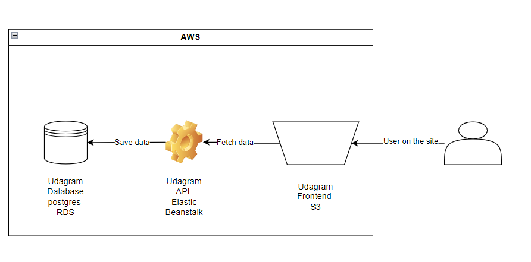

# Infrastructure Description

## Diagram

# AWS Services

## 1- AWS RDS

- Create and host the postgres database
- Save the link to access the created database
- Allow access from anywhere

## 2- AWS Elastic Beanstalk

- Create and host the node application ( API ) run as server
- Listen from the frontend and send response
- Can communicate with the database to retrieve the data
- Response with the proper data and status code to the frontend application

## 3- AWS S3 Bucket

- Create and host the frontend application
- Allows users contact with the static website
- Send requests to the API and getting response back

# Circle Ci

- Used with the Github repo to trigger any change in the main branch
- After any change in the repo it will start a workflow
- Main usage for it is building, testing, and deploying the project using automation.