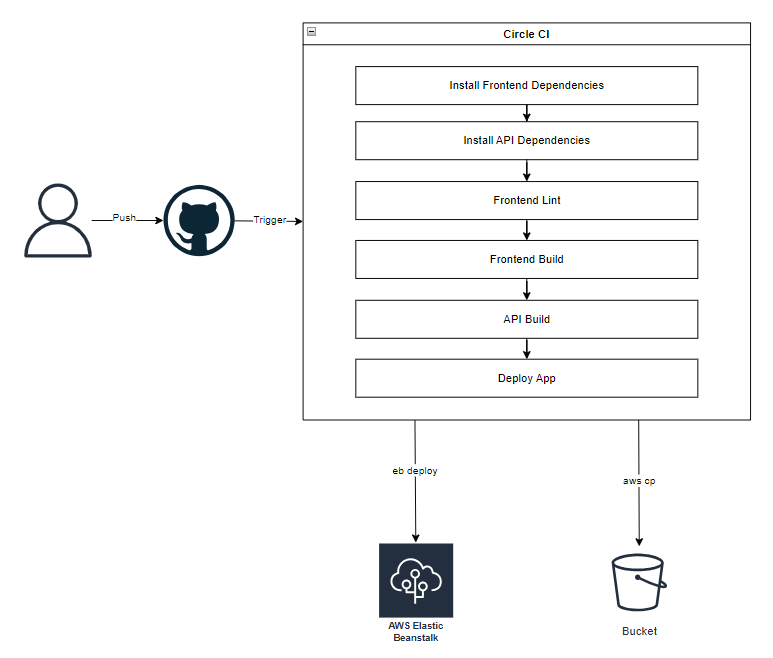

# Pipeline Process

## Circle Ci allows we to automate the building, testing and deploying phases for our application

## Steps

- Developer update the code localy [ add new feature, fix a bug, ...etc ]
- Push the changes to the github repo which connect wit circleci
- Circle Ci will trigger this changes and will start the pipeline
  - Build
    - Install Node
    - Install Front-End Dependencies
    - Lint Front-End Dependencies
    - Install API Dependencies
    - Build Front-End
    - Build API

  - Hold
    - Hold developer confirm AWS is good then approval to deploy the application

  - Deploy
    - Install AWS Elastic Beanstalk
    - Install AWS CLI
    - Update API code in Elastic Beanstalk ( Deploy The API )
    - Update Front-End code in S3 Bucket ( Deploy The Front-End )

